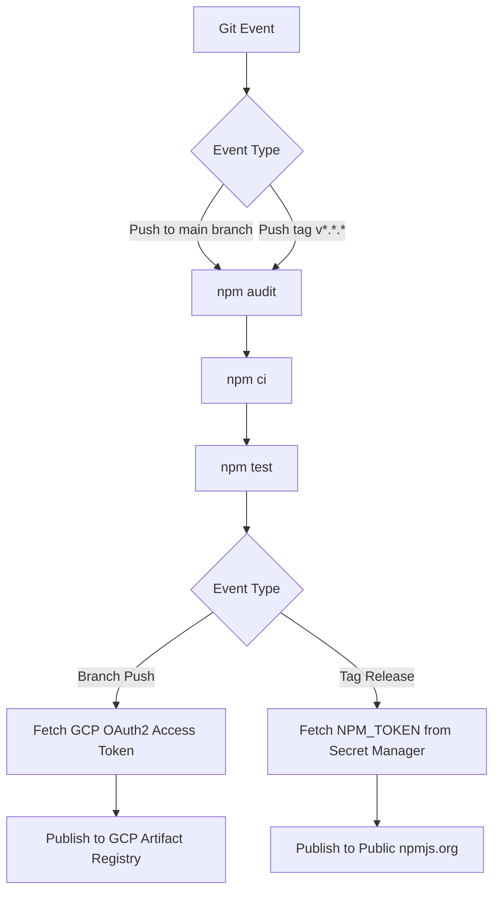

# @christian-wechsel/create-gcp-ts

An interactive CLI to scaffold production-ready TypeScript projects pre-configured for **Google Cloud Platform (GCP)**, **Terraform**, and **Cloud Build CI/CD**.

---

## Overview

Starting a new TypeScript project targeted for Google Cloud often requires repetitive configuration: setting up strict TypeScript builds, separating unit and integration test suites, configuring Docker/Cloud Build pipelines, provisioning Artifact Registry NPM repositories, and managing IAM roles.

`create-gcp-ts` automates this entire setup in seconds. It creates a standardized project structure with:

- **Strict TypeScript configuration** (`tsconfig.json`, `tsconfig.prod.json`, `tsconfig.test.json`).
- **Jest test setup** with separate configurations for unit tests (`*.test.unit.ts`) and integration tests (`*.test.int.ts`).
- **Cloud Build 2nd Gen CI/CD pipeline** (`cloudbuild.yaml`) with security audit, test execution, and dual-mode automated publishing:
  - **Internal releases:** Pushes to the main branch automatically publish packages to a private **GCP Artifact Registry** NPM repository.
  - **Public releases:** Pushes with Git tags (e.g., `v1.0.0`) automatically publish to **npmjs.org** using an NPM authentication token securely retrieved from **GCP Secret Manager**.
- **Infrastructure as Code (Terraform)** to manage Cloud Build triggers, IAM permissions, and Artifact Registry repositories.

---

## Prerequisites

Before using the generated projects with Google Cloud and Terraform, ensure you have the following installed and configured:

1. **Node.js**: `v20.x` or `v24.x` (LTS recommended) and `npm`.
2. **Google Cloud SDK (`gcloud`)**: Installed and authenticated:

   ```shell
   gcloud auth login
   gcloud auth application-default login
   ```

3. **Terraform**: `>= 1.5.0` installed.
4. **GitHub Connection in Cloud Build**: A Cloud Build 2nd Gen host connection to your GitHub repository in your GCP project.

---

## Quick Start

Create an empty directory for your new project and run the generator:

```shell
mkdir my-new-project
cd my-new-project

# Run via npx
npx @christian-wechsel/create-gcp-ts@latest

# Or using npm create
npm create @christian-wechsel/gcp-ts@latest
```

The CLI will guide you through interactive prompts:

1. **Project Name**: Enter your package name (e.g., `@my-org/my-package` or `my-app`).
2. **Project Type**: Select the template that matches your target:
   - **`lib`**: TypeScript library / NPM package with dual publishing to GCP Artifact Registry and npmjs.
   - **`node-project`**: Standalone Node.js TypeScript application with Cloud Build triggers.
   - **`gcp-infrastructure`**: Shared GCP baseline infrastructure (Artifact Registry NPM repo, Cloud Build Service Account, and IAM bindings).
   - **`server`**: *(In development)* Backend server template.

---

## Project Templates

| Template | Intended Use | Key Features |
| :--- | :--- | :--- |
| **`lib`** | Reusable TypeScript libraries / NPM packages | Dual CI/CD publishing (internal GCP Artifact Registry on branch push, public npmjs on tag release), Jest test suites, `.d.ts` declaration generation. |
| **`node-project`** | Node.js backend applications and services | TypeScript compilation, Jest testing, Cloud Build triggers for continuous integration and automated builds. |
| **`gcp-infrastructure`** | Central GCP infrastructure setup | Creates the shared Artifact Registry NPM repo, Cloud Build Service Account, and required IAM roles once per GCP project. |

---

## Getting Started with Scaffolding

After generating a project (e.g., `lib` or `node-project`), follow these steps:

### 1. Install Dependencies

```shell
npm install
```

### 2. Configure Terraform Variables

Each generated project includes Terraform files to provision Cloud Build triggers connected to your GitHub repository.

```shell
cp terraform.tfvars.example terraform.tfvars
```

Edit `terraform.tfvars` with your project's specific details:

> **Security Note:** `terraform.tfvars` contains sensitive deployment metadata and is automatically ignored by `.gitignore`. Never commit this file.

### 3. Deploy Cloud Build Triggers

Initialize and apply the Terraform configuration:

```shell
terraform init
terraform apply
```

This sets up:

- A Cloud Build trigger listening for pushes to your target branch (e.g. `main`).
- A Cloud Build trigger listening for tag releases (e.g. `v*`).

---

## Available NPM Scripts

Generated projects include standard scripts:

| Command | Description |
| :--- | :--- |
| `npm run build` | Compiles TypeScript using `tsconfig.json` into `dist/`. |
| `npm run build-prod` | Performs a clean compilation using `tsconfig.prod.json`. |
| `npm test` | Compiles test builds and runs all Jest tests. |
| `npm run test:unit` | Executes only unit tests (`*.test.unit.ts`). |
| `npm run test:int` | Executes only integration tests (`*.test.int.ts`). |
| `npm start` | Executes the compiled application (`node dist/index.js`). |
| `npm run debug` | Launches Node.js with the inspector enabled (`--inspect-brk`). |
| `npm run clean` | Deletes previous build outputs in `dist/`. |

---

## CI/CD Pipeline Workflow

The generated `cloudbuild.yaml` implements an automated release workflow:



1. **Security Audit**: Runs `npm audit --audit-level=high`.
2. **Dependency Installation**: Runs clean installation with `npm ci`.
3. **Tests**: Executes all test suites via `npm test`.
4. **Publishing**:
   - **Branch Push (`main`)**: Uses GCP OAuth token from the Cloud Build service account to publish to your private Artifact Registry.
   - **Tag Release (`v*`)**: Fetches `NPM_TOKEN` from GCP Secret Manager and publishes publicly to npm.

---

## License

This project is licensed under the [MIT License](LICENSE).
