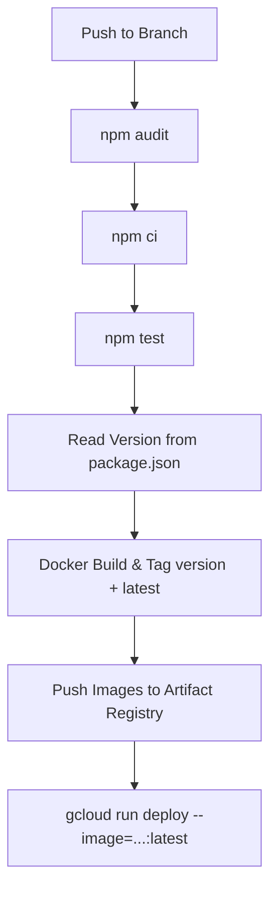

# Cloud Run TypeScript Service for Google Cloud

A production-ready TypeScript microservice deployed as a serverless container on **Google Cloud Run**, pre-configured with strict TypeScript compilation, Jest test suites, multi-stage Docker containerization, automated CI/CD via **Google Cloud Build**, and full infrastructure provisioning using **Terraform** on Google Cloud Platform (GCP).

This template is designed to run on top of baseline GCP project infrastructure provisioned with the **`server-infrastructure`** template.

---

## Features

- **TypeScript with ESM**: Modern ES modules setup with strict compiler checks (`tsconfig.json`, `tsconfig.prod.json`, `tsconfig.test.json`).
- **Express HTTP Service**: Lightweight Express service configured to run on Cloud Run, respecting container contracts (`PORT` environment variable, default 8080).
- **Containerization (Docker)**:
  - Multi-stage `Dockerfile` (`node:24-slim`) separating build and production environments.
  - Hardened with non-root runtime execution (`USER node`).
  - Production image contains only production dependencies (`npm ci --omit=dev`) and compiled TypeScript output.
- **Infrastructure as Code (Terraform)**:
  - **Built on `server-infrastructure`**: Deploys into a GCP project provisioned with the `server-infrastructure` baseline (which configures the GCP project, enables APIs, provisions the Artifact Registry Docker repository, and creates the Cloud Build service account).
  - **Cloud Run v2 Service (`cloud_run.tf`)**: Fully managed serverless container service with configured CPU allocation and autoscaling (up to 3 instances).
  - **IAM & Least-Privilege Identity (`iam.tf`)**: Dedicated runtime service account (`${name_prefix}-runner-sa`) and public unauthenticated access configuration (`roles/run.invoker` for `allUsers`).
  - **Cloud Build Trigger (`trigger.tf`)**: Push trigger linked to a GitHub 2nd Gen connection to automatically run `cloudbuild.yaml` on branch updates.
- **Automated CI/CD (Cloud Build)**: Pre-configured `cloudbuild.yaml` pipeline with automated dependency audits (`npm audit`), test runs, dynamic semantic version tagging, Docker build & push to Artifact Registry, and zero-downtime deployment to Cloud Run via `gcloud run deploy`.
- **Jest Test Framework**: Separated unit testing (`*.test.unit.ts`) and integration testing (`*.test.int.ts`).

---

## Project Structure

```text
├── bin/
│   └── clean.sh                 # Cleans dist/ build outputs
├── src/
│   └── index.ts                 # Express application entry point
├── cloud_run.tf                 # Cloud Run v2 service definition
├── cloudbuild.yaml              # Cloud Build CI/CD & deployment pipeline
├── Dockerfile                   # Multi-stage production container build
├── iam.tf                       # Runtime service account and IAM role bindings
├── jest.config.mjs              # Jest project configuration
├── output.tf                    # Terraform output values (Cloud Run URL)
├── provider.tf                  # Terraform Google provider config
├── terraform.tfvars.example     # Template for Terraform variables
├── trigger.tf                   # Cloud Build push trigger linked to GitHub
├── tsconfig.json                # Base TypeScript compiler options
├── tsconfig.prod.json           # Production build options
├── tsconfig.test.json           # Test build options
└── variables.tf                 # Terraform variable definitions
```

---

## Prerequisites & Baseline Infrastructure

This template assumes that the foundational GCP project infrastructure has already been provisioned using the **`server-infrastructure`** template:

1. **Baseline Project (`server-infrastructure`)**:
   - Provisions the dedicated GCP project and links billing.
   - Enables core APIs (`run.googleapis.com`, `cloudbuild.googleapis.com`, `artifactregistry.googleapis.com`, etc.).
   - Creates the Artifact Registry Docker repository (`docker-repo`).
   - Provisions the custom Cloud Build service account (`cloudbuild-custom-sa`).

2. **Cloud Build 2nd Gen GitHub Connection**:
   - Your GitHub account and repository must be connected to GCP Cloud Build (2nd Gen) so push triggers can fire.
   - This connection must be configured and authorized in GitHub:
     1. In **Google Cloud Console** > **Cloud Build** > **Repositories** (under **2nd gen**), click **Create host connection**.
     2. Authorize and install the **Google Cloud Build GitHub App** on your GitHub account or organization.
     3. Click **Link repository** to link the target GitHub repository under this connection.

3. **Local Tools**:
   - Node.js (`v20.x` or `v24.x`) and `npm`.
   - Google Cloud SDK (`gcloud`) authenticated:

     ```shell
     gcloud auth login
     gcloud auth application-default login
     ```

   - Terraform (`>= 1.5.0`).

---

## Getting Started

### 1. Install Dependencies

```shell
npm install
```

### 2. Local Development

Start the local service:

```shell
npm run build
npm start
```

Or run with the debugger attached:

```shell
npm run debug
```

By default, the service listens on port 8080 (or the port defined by `PORT`).

### 3. Configure Terraform Variables

Copy the example variables file:

```shell
cp terraform.tfvars.example terraform.tfvars
```

Populate `terraform.tfvars` using the outputs from your **`server-infrastructure`** baseline:

| Variable | Description | Source |
| :--- | :--- | :--- |
| `project_id` | GCP Project ID | `server-infrastructure` output `project_id` |
| `location` | GCP Region (e.g. `europe-west3`) | `server-infrastructure` output `location` |
| `repository` | Artifact Registry Docker repo | `server-infrastructure` output `docker_repository` |
| `service_account_build_id` | Cloud Build SA ID | `server-infrastructure` output `cloudbuild_service_account` |
| `name_prefix` | Unique prefix for service and IAM names | e.g. `my-cloudrun-service` |
| `trigger_branch_name` | Git branch that triggers CI/CD | e.g. `main` |
| `github_username` | GitHub user or organization name | Your GitHub username/org |
| `github_repo_name` | Name of repository on GitHub | Your GitHub repo name |
| `connection_name_gcp_github` | Cloud Build 2nd Gen GitHub connection | Name of existing connection |

> **Security Note:** `terraform.tfvars` contains local infrastructure configuration and is excluded by `.gitignore`. Do not commit this file to Git.

### 4. Deploy Infrastructure (Terraform)

Initialize Terraform and apply the configuration to create the Cloud Run service, runtime IAM identity, and Cloud Build trigger:

```shell
terraform init
terraform apply
```

### 5. Inspect Service & Deployment

Retrieve the deployed Cloud Run service URL and status:

```shell
# Display the Cloud Run URL
terraform output cloud_run_url

# List all Cloud Run services
gcloud run services list

# Inspect detailed service settings
gcloud run services describe <SERVICE_NAME> --region <REGION>
```

When code is pushed to your configured trigger branch (e.g., `main`), Cloud Build automatically tests the code, builds the container image, pushes it to Artifact Registry, and deploys the new revision to Cloud Run.

---

## Development Scripts

| Command | Description |
| :--- | :--- |
| `npm run build` | Compiles TypeScript using `tsconfig.json` into `dist/`. |
| `npm run build-prod` | Performs a clean compilation using `tsconfig.prod.json`. |
| `npm start` | Runs the compiled service (`node dist/index.js`). |
| `npm run debug` | Starts Node.js with the debugging inspector enabled (`--inspect-brk`). |
| `npm test` | Runs the full Jest test suite (unit + integration). |
| `npm run test:unit` | Runs only unit tests (`*.test.unit.ts`). |
| `npm run test:int` | Runs only integration tests (`*.test.int.ts`). |
| `npm run clean` | Deletes build outputs in `dist/`. |

---

## CI/CD Pipeline Workflow

The included `cloudbuild.yaml` pipeline runs whenever changes are pushed to your trigger branch:



1. **Security Audit**: Runs `npm audit --audit-level=high`.
2. **Dependency Installation**: Runs clean installation with `npm ci`.
3. **Automated Tests**: Runs test suites via `npm test`.
4. **Version Tagging**: Extracts the current version from `package.json`.
5. **Docker Build & Push**: Builds the container image via Docker and pushes two tags (`:<version>` and `:latest`) to Artifact Registry.
6. **Cloud Run Deployment**: Executes `gcloud run deploy` with the runtime service account (`${name_prefix}-runner-sa`) and `--allow-unauthenticated` for zero-downtime rolling deployment.

---

## License

This project is licensed under the [MIT License](LICENSE).
